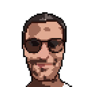

# Portfolio

    French front-end in professional transition

front en beginner, looking for his first opportunity

## Certifications

- **openclassrooms**: JavaScript React Developer 💻...**_in progess_**
- **openclassrooms**: Web Developer 💻...**_in progess_**
- **freeCodeCamp**: JavaScript Algorithms and Data Structures 💻...**_in progess_**
- [**freeCodeCamp** : ](https://www.freecodecamp.org/certification/git504/responsive-web-design)Responsive Web Design
- [**Google Digital Garage** : ]() Fundamentals of Digital Marketing

## Hobbies

- 🧘 **Yoga**: hatha & yin
- ⛰️ **Hiking**: gr20 Corsica / Traveling / Europe

## Driver's license

- 🚗 **car**
- 🛵 =< **125c3**

---

[contact](https://github.com/git504)
