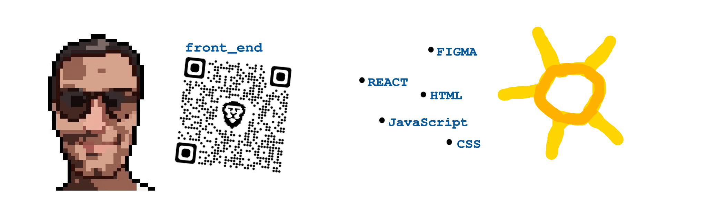

<!-- # cheapskatePortfolio -->

<!--  -->

<!--  -->

## Applying for a front-end work-study program

Je cherche une belle opportunité Frontend React en contrat d'apprentissage de 12 mois.

    👨 39, I am applying
    for a first junior level
    frontend opportunity.

    🌱 100% committed to
    the OPENCLASSROOMS's
    learning process
    till november 2022

The projects 📌 pinned in my [**Github**](https://github.com/git504) are an important part of my learning process and show my understanding of JS stack.

## Certifications 🎓

⏳ [**openclassrooms** ](https://www.francecompetences.fr/recherche/rncp/35976/) JavaScript **React frontend**

⏳ [**freeCodeCamp** ](https://www.freecodecamp.org/git504) Front End Development **Libraries**

☑ [**openclassrooms** ](https://www.francecompetences.fr/recherche/rncp/32173/) Dev web **PERN MERN**

☑ [**freeCodeCamp** ](https://www.freecodecamp.org/certification/git504/javascript-algorithms-and-data-structures) JavaScript Algorithms and Data Structures☑ [**freeCodeCamp** ](https://www.freecodecamp.org/certification/git504/responsive-web-design) Responsive Web Design

☑ [**Google Digital Garage**](https://github.com/git504/git504/blob/main/Developer%20Certification/Google%20garage%20Marketing.pdf) Fundamentals of Digital Marketing

## Career path

2020 to today | **frontend Student** | in career Transition | Openclassrooms

2019 | **Printmaker** | Design | freelance

## Hobbies

- 🧘 Yoga
- ⛰️ Hiking / Training
- 🏕️ Traveling / Europe

## [Contact me using this link](https://github.com/git504/cheapskatePortfolio/blob/main/contact.md) 💬

---

    🙏 Thankie
    for being my reader
    made with love
    in full stack ***Markdown***

<!--  -->
